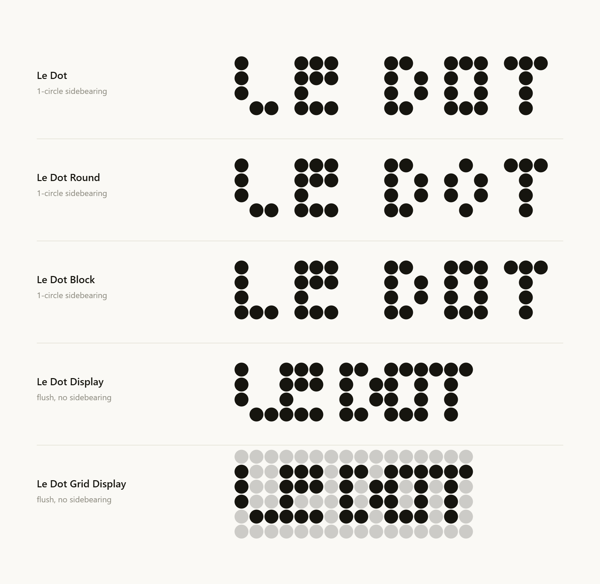
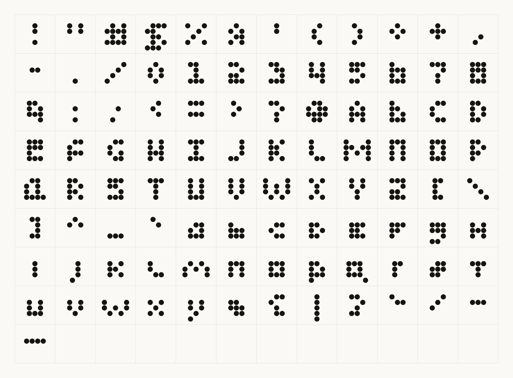
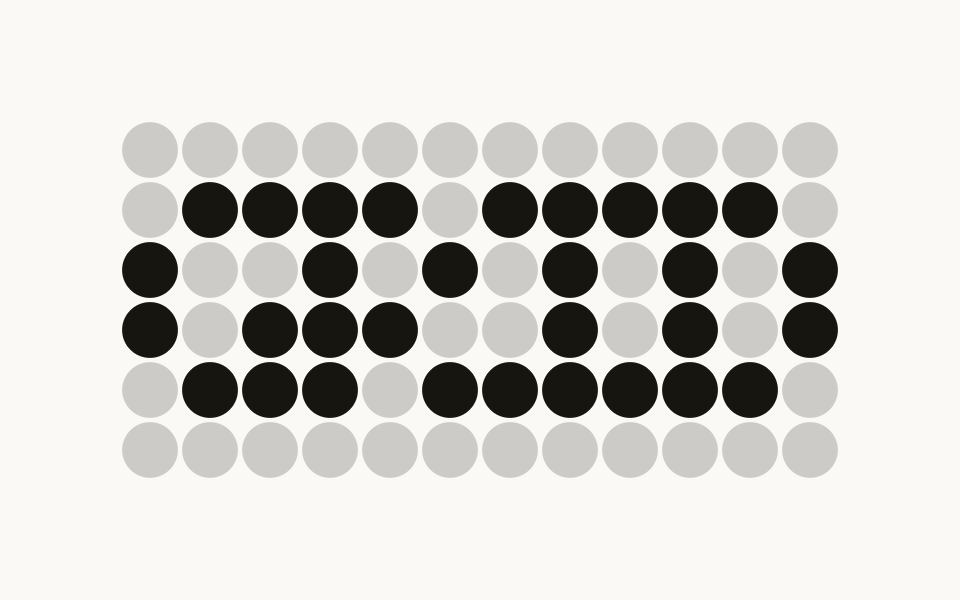

# Le Dot

A typeface created by **Dylan Le**. Le Dot experiments with a systematic yet experimental design
language following a grid format. Every letter is assembled from circles that snap to a fixed
matrix. Nothing drawn freehand, nothing sitting off-grid. It reads as engineered rather than
lettered, and legibility arrives as a consequence of the system instead of a compromise with it.
Five cuts run from a workable text weight through to a full-bleed display matrix, plus a backdrop
companion for design tools that cannot read color fonts.

Structurally: dots are 13 units across on a 14-unit pitch, built at 250 units on a 1000-unit em, so
one dot and one row each measure a quarter of an em. The cap box is four rows tall and descenders
drop one row below the baseline. All five cuts share that matrix and those metrics conventions, but
Round and Block are distinct dot arrangements, Round sparser than Regular and Block denser, while
Display and Grid Display carry Regular's exact glyphs, respaced to set flush. 97 glyphs per cut.



## Download

### [↓ Download every cut (.zip)](https://github.com/dyyle02/Le-Dot/archive/refs/heads/main.zip)

Unzip, then double-click each `.ttf` to install. Or grab one cut on its own:

| Cut | | |
| --- | --- | --- |
| **Le Dot** | the text cut, start here | [download](https://github.com/dyyle02/Le-Dot/raw/main/LeDot-Regular.ttf) |
| **Le Dot Round** | sparser, lighter on the page | [download](https://github.com/dyyle02/Le-Dot/raw/main/LeDotRound-Regular.ttf) |
| **Le Dot Block** | denser, heaviest on the page | [download](https://github.com/dyyle02/Le-Dot/raw/main/LeDotBlock-Regular.ttf) |
| **Le Dot Display** | flush setting, for large sizes | [download](https://github.com/dyyle02/Le-Dot/raw/main/LeDotDisplay-Regular.ttf) |
| **Le Dot Grid Display** | flush, with the 20% matrix printed | [download](https://github.com/dyyle02/Le-Dot/raw/main/LeDotGridDisplay-Regular.ttf) |
| **Le Dot Grid Backdrop** | the matrix on its own, for Figma | [download](https://github.com/dyyle02/Le-Dot/raw/main/LeDotGridBackdrop-Regular.ttf) |

## Character set

97 glyphs per cut: uppercase, lowercase, figures, and punctuation.



## Le Dot Grid Display



Grid Display is a **two-color font** (`COLR`/`CPAL`): the 20% grid is part of each glyph, not a
layer you composite yourself. Lit dots take the text color; unlit dots print at 20% of black.

**It works in browsers. It does not work in Figma.** Figma, and most other design tools, ignore
`COLR` entirely and draw only the base letterforms, so the faint grid silently disappears. That is
a limitation of the app, not the font.

### Using the grid in Figma

Use **Le Dot Grid Backdrop** as a second layer. It is an ordinary single-color font in which every
glyph is a solid block of dots filling its whole cell, with metrics identical to Grid Display.

1. Bottom layer — your text in **Le Dot Grid Backdrop**, at 20% opacity
2. Top layer — the same text in **Le Dot Display**, full opacity, aligned exactly on top

Because the advance widths match to the unit, the two layers land dot for dot. Set both to the same
size and `1.5` line height. This also buys you something the color font can't do: the backdrop can
be any color you like, not just 20% of the ink.

## Metrics

One dot = ¼ em, one row = ¼ em.

- **Cap box** — 4 rows (1 em)
- **Descender** — 1 row below the baseline
- **Seamless leading** — `1.25` for Regular, Round, Block and Display; `1.5` for Grid Display and
  Grid Backdrop, whose glyph box carries an extra row above the caps and below the baseline

Set leading explicitly. "Auto" is usually close, but Figma and Adobe sometimes pad it, which breaks
the grid alignment between lines.

## Use on the web

```css
@font-face {
  font-family: "Le Dot";
  src: url("LeDot-Regular.ttf") format("truetype");
  font-weight: 400;
}

h1 {
  font-family: "Le Dot", monospace;
  line-height: 1.25;
}
```

## Specimen

`index.html` is a self-contained specimen with a live tester, a size waterfall, the full character
set, and a before/after record of the symbol redraws. Open it locally, or turn on GitHub Pages
(Settings → Pages → deploy from `main` / root) to put it online.

## License

[SIL Open Font License 1.1](LICENSE) with **Le Dot** as a Reserved Font Name. Free to use, embed and
sell with your work; derivatives must stay under the OFL and ship under a different name.
